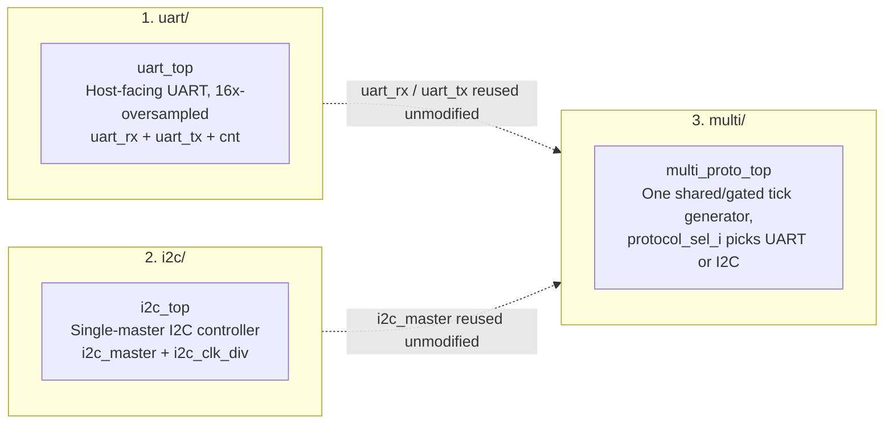

# Multi-Protocol Serial Communication Block (UART & I2C)


## Specifications & Target Hardware

* **Target Device:** Xilinx Artix-7 (xc7a100tcsg324-1 / Digilent Arty A7-100T)
* **System Clock:** 100 MHz onboard oscillator
* **UART Configuration:** 8N1 (8 data bits, no parity, 1 stop bit), 16x oversampling, 9600 baudrate
* **I2C Configuration:** Single-Master controller with clock stretching support
* **Toolchain:** Xilinx Vivado (Synthesis & Implementation), ModelSim / GHDL (Simulation)

---

This is my internship project at **tecnun (University of Navarra) / CEIT**, in the Electrical and Electronic Engineering department. The goal: build a multi-protocol serial communication block in VHDL, from scratch, and get it running on real FPGA hardware.

I'm an AI + Telecommunications Engineering student, and I had written some VHDL for classwork before but had never touched an FPGA toolchain end to end — no Vivado, no real board, no hardware bring-up. This project was my first time doing the full loop: protocol theory → RTL → simulation → synthesis → hardware, and debugging when reality didn't match the waveform. I worked with the ARTY A7-100T board.


## What it does

Three serial protocols, each implemented and verified on its own, then merged into one shared block:

1. **UART** — a standard 8N1-style transceiver, 16x oversampled, host-facing (exposes clean start/byte/done signals).
2. **I2C** — a single-master controller: START/address/ACK/data/STOP, with clock stretching support.
3. **Multi-protocol top** — a shared block that reuses the UART and I2C engines *unmodified* and switches between them at runtime with a `protocol_sel_i` input, sharing a single tick generator instead of duplicating clocking logic for each protocol.



## How I worked through it

I built this in three stages, on purpose — each one fully closed out before starting the next:

**1. Learn the protocol first.** Before writing a line of VHDL, I made sure I actually understood the protocol — the electrical behaviour, the timing, the edge cases. For UART that meant reading documentation and thinking through framing and parity by hand. For I2C, watching real I2C traffic on a logic analyzer while reading the spec, so I wasn't just implementing what a datasheet said but what I'd actually seen on a bus.

**2. Design the FSM and write the RTL.** Each protocol got its own state machine, designed on paper first (state diagrams, timing budget, clock math) and then translated into VHDL. I kept the two FSMs structurally close — same coding style, same single-process synchronous pattern — so that later, merging them into one block wouldn't mean untangling two completely different ways of writing VHDL.

**3. Test in simulation.** Every block got its own testbench in ModelSim before I trusted it near real hardware. This is where most of my actual debugging happened — watching waveforms, catching timing assumptions that looked fine in my head but weren't fine in signal traces.


**4. Validate on real hardware.** Only once simulation passed did I move to Vivado and the Arty A7 board. This step taught me the most, honestly — simulation is patient with you, hardware is not. I hit real integration bugs here (a timing bug in one of the I2C signals that only showed up once, on the actual board, is documented in the I2C bring-up log) that never appeared in ModelSim, which was a good lesson in why "it works in simulation" and "it works" are two different sentences.


## What I learned

- **VHDL itself** — writing clean, synthesizable, synchronous RTL, and being consistent about it across modules so a later merge doesn't turn into a rewrite.
- **How to debug hardware, not just code** — reading waveforms critically, and treating a board that doesn't behave as expected as information, not just an error to dismiss.
- **How to structure a project like this** — protocol first, then design, then simulate, then validate on hardware. Skipping a step always cost more time later than doing it properly would have.
- **Vivado and the FPGA flow** — my first real project using it: constraints files, synthesis, implementation, and getting a bitstream onto actual silicon.
- **Design for reuse** — building the UART and I2C blocks so the multi-protocol top could share them *unmodified* forced me to think about interfaces and shared resources from the start, instead of bolting things together at the end.

## Repo structure

```
uart/     UART transmitter/receiver + baud-rate generator
i2c/      I2C master + SCL phase generator
multi/    Shared top level: reuses uart_rx/uart_tx/i2c_master behind a
          protocol selector, with one shared/gated tick generator
docs/     Vivado guide
```

Each of `uart/`, `i2c/`, `multi/` follows the same internal layout:

```
rtl/      Synthesizable VHDL sources
sim/      Testbenches and ModelSim .do scripts
vivado/   Hardware-bringup-only files: board wrapper (if needed), .xdc
          constraints, and a create_project.tcl that regenerates the whole
          Vivado project from these files
docs/     That block's own architecture report
```

Simulated in ModelSim (cross-checked with GHDL); `uart/` and `i2c/` additionally include a Vivado hardware bring-up path for a real Arty A7 board. I haven't done it with the multi block because it could be redundant and I didn't have more time, but could be interesting for the future.

## Docs

- [`uart/docs/uart_report.md`](uart/docs/uart_report.md) — UART architecture report.
- [`uart/docs/uart_hw_bringup.md`](uart/docs/uart_hw_bringup.md) — UART hardware bring-up: loopback test over the Arty A7's onboard USB-UART bridge.
- [`i2c/docs/i2c_report.md`](i2c/docs/i2c_report.md) — I2C architecture report.
- [`i2c/docs/i2c_hw_bringup.md`](i2c/docs/i2c_hw_bringup.md) — I2C hardware bring-up on a real Arty A7 + TMP102 sensor, including the full debug journal.
- [`multi/docs/multi_proto_report.md`](multi/docs/multi_proto_report.md) — Shared top-level architecture report.
- [`docs/vivado_guide.md`](docs/vivado_guide.md) — Adding sources/constraints, recreating a project from a `.tcl` script, generating a bitstream. Not block-specific.

## Simulating (ModelSim quick-start)

Each block includes an automated script (`sim/run_sim.do`) to compile source files, set up waveforms, and run the simulation in one step. Navigate to the corresponding `sim/` folder and execute:

```
do run_sim.do
```

## Hardware Bring-Up (Vivado)

For complete, step-by-step instructions on synthesizing, implementing, and programming the FPGA board, refer to the detailed guide in [`docs/vivado_guide.md`](docs/vivado_guide.md)
