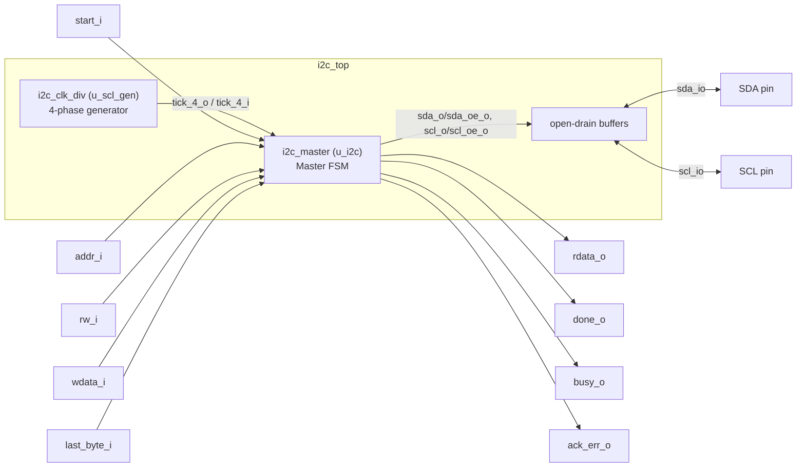
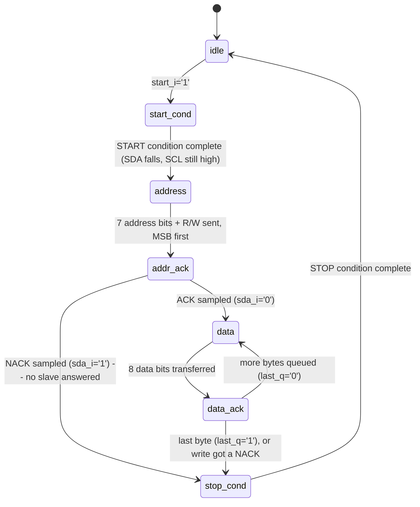

# I2C Architecture Report

Analysis of the VHDL design in `rtl/` (3 files) and its verification in `sim/` (2 testbenches).

## 1. Overview

`i2c_master.vhd` is a single-master I2C controller driven by a small host command interface (`start_i`/`addr_i`/`rw_i`/`wdata_i`/`last_byte_i` in, `rdata_o`/`done_o`/`busy_o`/`ack_err_o` out) rather than a fixed built-in transaction — unlike the UART block's echo design, there is no self-contained "mode," the host drives every byte explicitly.

Each bit takes **4 phases** (quarter-ticks) of a shared phase generator: t1 forces SCL low and sets up the next SDA value, t2 releases SCL (and supports **clock stretching** — it waits for the slave to let SCL rise), t3 is the bit's valid/sample point, t4 ends the bit. Addressing and data are **MSB first**.

## 2. Block diagram



Key points:

- `i2c_master` itself never touches a physical pin — it exposes split `sda_i`/`sda_o`/`sda_oe_o` (and the SCL equivalents), and only `i2c_top` resolves those into the real open-drain `sda_io`/`scl_io` pins. This is what lets the same `i2c_master` be reused unmodified inside `multi/` behind a different set of logical ports.
- One shared phase generator (`i2c_clk_div`) drives the master; there's only one instance, so there's no independent-clock-domain concern the way UART's shared baud generator has between RX and TX.
- Hardware bring-up files (`i2c_hw_top.vhd`, `i2c_hw_top.xdc`) live in `vivado/` for testing on real Arty A7 hardware — see [`i2c_hw_bringup.md`](i2c_hw_bringup.md) for the build steps and the full bring-up debug journal; they are not exercised by either testbench here.

## 3. `i2c_clk_div.vhd` — Phase generator

Free-running counter with threshold:

```
phase_max = clk_freq / (4 * scl_freq)
```

With the default generics (`clk_freq=100 MHz`, `scl_freq=100 kHz`): `phase_max = 250`. `tick_4_o` is a single-cycle pulse — 4 of them make up one SCL period, matching `i2c_master`'s 4-phase-per-bit timing.

## 4. `i2c_master.vhd` — Master FSM



| State        | Behavior                                                                                                                                                                                                                          |
| ------------ | --------------------------------------------------------------------------------------------------------------------------------------------------------------------------------------------------------------------------------- |
| `idle`       | Bus released (`sda_oe_o`/`scl_oe_o`='0'). On `start_i='1'`: latches `shift_reg <= addr_i & rw_i`, `rw_q`, `last_q` → `start_cond`.                                                                                                |
| `start_cond` | Drives SDA low while SCL stays released/high — the START condition.                                                                                                                                                               |
| `address`    | 4-phase bit timing (t1 drive next bit / t2 release SCL, **stalls here on clock stretching** / t3 bit valid / t4 advance). Sends the 7-bit address + R/W, MSB first.                                                               |
| `addr_ack`   | Releases SDA so the slave can drive the ack, samples it at t3. NACK (`sda_i='1'`) aborts straight to `stop_cond`; ACK loads the first data byte and continues to `data`.                                                          |
| `data`       | Same 4-phase timing as `address`. Write: master drives `shift_reg(7)` at t1. Read: `sda_oe_o` stays released, the incoming bit is captured from `sda_i` at t3.                                                                    |
| `data_ack`   | Write: releases SDA to read the slave's ack/nack. Read: the *master* drives the ack bit — `last_q='0'` (ACK, want more bytes) or `last_q='1'` (NACK, this was the last byte). Pulses `done_o` once per completed byte either way. |
| `stop_cond`  | Forces SCL low and drives SDA low, then releases SCL and raises SDA while SCL is high — the STOP condition — and returns to `idle`.                                                                                               |

One protocol detail worth flagging for anyone driving this from a host: `wdata_i`/`last_byte_i` must be pre-loaded **one byte ahead** — the comment in the source is explicit that they're "sampled at `start_i` and at each `done_o`," so the value that matters for byte *N+1* has to already be in place by the time byte *N*'s `done_o` fires.

## 5. `i2c_top.vhd` — Structural integration

Instantiates `i2c_clk_div` + `i2c_master` and adds the one piece of logic `i2c_master` deliberately doesn't own: the open-drain buffers that turn `sda_o`/`sda_oe_o` (and the SCL equivalent) into a real bidirectional `sda_io` pin (`'0'` when actively driven, `'Z'` — released to the external pull-up — otherwise), plus `to_x01`-based input buffering so simulation matches how a real input comparator resolves the pull-up's weak level to a clean `'0'`/`'1'`.

## 6. Testbench coverage (`sim/`)

| Testbench           | DUT(s)                                                              | Coverage                                                                                                             |
| ------------------- | ------------------------------------------------------------------- | -------------------------------------------------------------------------------------------------------------------- |
| `tb_i2c_master.vhd` | `i2c_clk_div` + `i2c_master` directly (split `sda_*`/`scl_*` ports) | 5 cases: 1-byte write (ACK), 2-byte write (tests chaining), 1-byte read, 2-byte read, write to an address that NACKs |
| `tb_i2c_top.vhd`    | `i2c_top` (full system, resolved `sda_io`/`scl_io`)                 | Same 5 cases, exercised through the open-drain bus instead of split ports                                            |

Both testbenches include a self-checking slave model: `assert ack_err_o` on the write and NACK cases, and `assert` on the read-path byte (`rdata_o`, captured into `v_read1`/`v_read2`) against the exact value the slave model's `v_rd_val` counter is expected to send — `0xA5` for the 1-byte read, `0xA6`/`0xA7` for the 2-byte read (it increments once per byte sent and carries over between cases).

## 7. Findings summary

- ✅ Single synchronous process (`p_i2c_core`), enum-based `t_state`, combinational `busy_o` — consistent with the rest of this codebase's style.
- ✅ Clock-stretching handled correctly: `address`/`addr_ack`/`data`/`data_ack` all wait for `scl_i='1'` before leaving t2, so a slow slave holding SCL low doesn't break timing.
- ✅ Correct MSB-first addressing/data and correct ACK/NACK semantics in both directions, including who drives the ack bit on a read vs. a write.
- ✅ `i2c_master` cleanly separates protocol logic from pin resolution (split `sda_i`/`sda_o`/`sda_oe_o`), which is exactly what let it be reused unmodified in `multi/`.
- ✅ Both testbenches assert the read-path byte(s) against the slave model's expected value, not just the write/NACK cases.
- 
- ⚠️ Single-master only: no arbitration or multi-master bus-busy detection.
