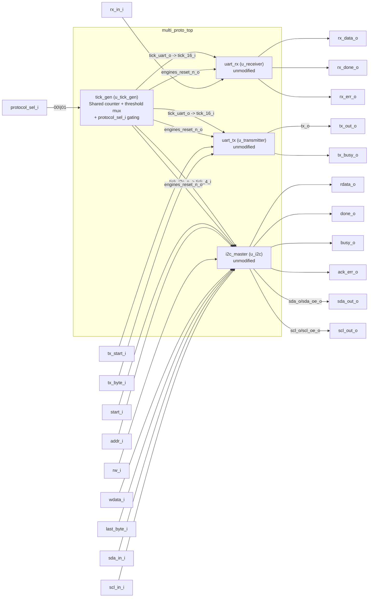

# Shared Multi-Protocol Block — Architecture Report

Analysis of the merge in `rtl/` (2 new files) on top of the already-verified `uart/rtl/` and `i2c/rtl/` blocks (reused unmodified), and of the verification in `sim/tb_multi_proto_top.vhd`.

## 1. Overview

`multi_proto_top.vhd` does **not** merge the two protocol FSMs into one: UART (single-wire, push-pull) and I2C (two-wire, open-drain, with ACK/NACK and clock stretching) are electrically too different for one `t_state` to cover both without adding complexity rather than removing it. Instead, only **hardware** is shared — specifically the tick generator: `cnt.vhd` (UART) and `i2c_clk_div.vhd` (I2C) are structurally the same free-running counter with a different threshold, so they're replaced by one new module, `tick_gen.vhd`, with the threshold selected at runtime.

`uart_rx`, `uart_tx`, and `i2c_master` are reused **as-is** (same `.vhd` files from `uart/rtl/` and `i2c/rtl/`, not a single line of their internal bit-sequencing logic touched). The only thing that changes relative to `uart_top.vhd`/`i2c_top.vhd` is where they get their tick pulse and reset from.

`protocol_sel_i` selects the active protocol: `"00"` = UART, `"01"` = I2C, `"10"`/`"11"` = reserved (no protocol active).

## 2. Block diagram



Key points:

- `tick_gen` is the only new component with logic of its own; everything else is direct reuse.
- The UART lines (`rx_in_i`/`tx_out_o`/`tx_oe_o`) and the I2C lines (`sda_*`/`scl_*`) are separate logical ports (`_out`/`_oe`/`_in`), not a shared physical pin — a future pin-mux/GPIO block can route them without touching this module.
- Both protocols expose their full host interface directly at the top level — UART's `tx_start_i`/`tx_byte_i`/`tx_busy_o`/`rx_data_o`/`rx_done_o`/`rx_err_o`, same as `uart_top.vhd`, and I2C's `start_i`/`addr_i`/.../`ack_err_o`, same as `i2c_top.vhd`. There is no internal echo wiring — `multi_proto_top` doesn't pick a "mode" for UART any more than it does for I2C; the host drives both explicitly.

## 3. `tick_gen.vhd` — Shared tick generator and reset

Same structural pattern as `cnt.vhd`/`i2c_clk_div.vhd`: a free-running counter that emits a single-cycle pulse on reaching a threshold. The difference is that the threshold is now a runtime-selected signal instead of a fixed constant:

```
uart_tick_max = clk_freq / (16 * baudrate)   -- same as cnt.vhd
i2c_phase_max = clk_freq / (4 * scl_freq)    -- same as i2c_clk_div.vhd

thresh_max <= i2c_phase_max when protocol_sel_i = "01" else uart_tick_max;
```

The raw pulse is then **gated** onto exactly one of two outputs, never both:

```
tick_uart_o <= tick_raw when protocol_sel_i = "00" else '0';
tick_i2c_o  <= tick_raw when protocol_sel_i = "01" else '0';
```

so the engine that isn't selected never sees a tick and can't advance its FSM — it stays parked, even though `tick_gen`'s own counter never stops running.

**`engines_reset_n_o` — automatic reset on protocol switch.** `uart_rx`'s `idle→start_bit` (on `rx_i='0'`) and `i2c_master`'s `idle→start_cond` (on `start_i='1'`) are *not* gated by the tick — they're checked on every clock edge regardless of which protocol is selected. Left alone, a stray trigger reaching the inactive engine (a glitch on `rx_in_i`, a stray `start_i`) would push it out of `idle` with no way back, since it will never receive another tick. `tick_gen` closes this by comparing `protocol_sel_i` against its value one cycle earlier and generating `engines_reset_n_o`: the external `reset_n` ANDed with a one-cycle pulse on every `protocol_sel_i` change. `multi_proto_top` feeds this combined signal — not the raw external `reset_n` — into `uart_rx`, `uart_tx`, and `i2c_master`, so every protocol switch forces all three engines through `idle` before the new tick stream starts, whether or not the host also asserts a reset.

## 4. `multi_proto_top.vhd` — Structural integration

Same shape as `uart_top.vhd`/`i2c_top.vhd`: component declarations + instantiation + port maps, with two pieces of logic of its own:

```
tx_oe_o  <= '1' when protocol_sel_i = "00" else '0';
sda_oe_o <= w_i2c_sda_oe_o when protocol_sel_i = "01" else '0';
scl_oe_o <= w_i2c_scl_oe_o when protocol_sel_i = "01" else '0';
```

This goes one step further than strictly necessary — `i2c_master` already releases the bus (`sda_oe_o`/`scl_oe_o`='0') at `idle`, and `uart_tx` already leaves `tx_o='1'` at rest — but gating `_oe` by `protocol_sel_i` at this level makes "only the active protocol can drive its line" true by construction, even if the host sends a stray `start_i` to the inactive protocol.

## 5. What's shared, and why

| Resource                    | Shared?                | Why                                                                                                                                                                                                                       |
| --------------------------- | ---------------------- | ------------------------------------------------------------------------------------------------------------------------------------------------------------------------------------------------------------------------- |
| Tick/counter generator      | ✅ Yes (`tick_gen.vhd`) | Both originals are the same free-running counter with a different threshold; unifying it with a mux + gate is the main simplification this merge is for.                                                                  |
| 8-bit shift register        | ❌ No                   | Interleaved with each FSM's parity/ACK logic and bit counting, inside the same synchronous process. Extracting it would mean rewriting that internal logic. A benefit (one 8-bit register) too small to justify the risk. |
| Protocol FSM (`t_state`)    | ❌ No                   | UART (1-wire, push-pull) and I2C (2-wire, open-drain, ACK/clock-stretch) are electrically distinct enough that one merged FSM would be more complex, not less.                                                            |
| Busy/done flags             | ❌ No                   | Each engine computes its own, combinationally, outside its own process — same as `uart_tx`/`i2c_master` already did.                                                                                                      |
| Each FSM's internal signals | ❌ No                   | Each synchronous process (`p_rx_core`, `p_tx_core`, `p_i2c_core`) stays self-contained; no signals cross between engines.                                                                                                 |

## 6. Testbench coverage (`sim/tb_multi_proto_top.vhd`)

| Phase                                                                                | What it does                                                                           | Verification                                                                                                                                                                                                         |
| ------------------------------------------------------------------------------------ | -------------------------------------------------------------------------------------- | -------------------------------------------------------------------------------------------------------------------------------------------------------------------------------------------------------------------- |
| 1 — UART CASE 1: host-driven TX                                                      | Drives `tx_start_i`/`tx_byte_i` directly with `0x41` (`protocol_sel_i="00"`)           | A dedicated process listens on `tx_out_o`, reconstructs the transmitted byte bit by bit, and `assert`s it against `0x41`, the computed parity, the stop bit, and `tx_oe_o='1'` — same technique as `tb_uart_top.vhd` |
| 1 — UART CASE 2: host-observed RX                                                    | Injects the same frame as `tb_uart_top.vhd` (0x41, 8N1 even parity) on `rx_in_i`       | A pulse-latching process captures `rx_done_o`/`rx_err_o`/`rx_data_o` (single-cycle pulses) and `assert`s the latched byte against `0x41` with no error flagged                                                       |
| Reset + switch to I2C (`protocol_sel_i="01"`)                                        | Full reset, then switches the selector                                                 | The "normal" path: explicit reset before activating the second protocol                                                                                                                                              |
| 2 — I2C: 1-byte write                                                                | `host_write` to `SLAVE_ADDR`, same slave model as `tb_i2c_master.vhd`/`tb_i2c_top.vhd` | `assert ack_err_o = '0'`                                                                                                                                                                                             |
| 2 — I2C: 1-byte read                                                                 | `host_read` of 1 byte                                                                  | `assert v_read1(0) = x"A5"` — checked byte-for-byte against what the slave model actually sends                                                                                                                      |
| 3 — switch to `protocol_sel_i="11"` (reserved) after I2C is already `idle`, no reset | Switches the selector long after the I2C transaction has cleanly finished              | `assert busy_o='0'` before and after, and `assert tx_oe_o=sda_oe_o=scl_oe_o='0'` — confirms a reserved code is inert when it isn't interrupting anything                                                             |

The individual `tb_uart_*.vhd` and `tb_i2c_*.vhd` testbenches were not modified and still work standalone.

## 7. Findings summary

- ✅ One shared tick generator (`tick_gen.vhd`) with a threshold mux and output gating — the inactive engine never receives a tick.
- ✅ `uart_rx`, `uart_tx`, and `i2c_master` reused with zero modification to their internal bit-sequencing logic; each remains a self-contained synchronous process.
- ✅ Logical ports (`_out`/`_oe`/`_in`) instead of physical pins, ready for a future pin-mux/GPIO block.
- ✅ Both protocols' `_oe` gated by `protocol_sel_i` at the top level, not just by each engine's own internal state — only the active protocol can ever drive its line, by construction.
- ✅ Protocol switches are self-resetting: `engines_reset_n_o` forces all three engines through `idle` on every `protocol_sel_i` change, so a switch can never resume a stale, half-finished transaction.
- ✅ Testbench self-checks byte-for-byte for UART TX and RX independently (no internal echo to piggyback on) and for the I2C read, not just waveform inspection.
- ✅ UART and I2C are symmetric at this level: both expose their full host interface at the top, with no internal wiring standing in for a host — matching `uart_top.vhd`/`i2c_top.vhd` exactly, not a special-cased "echo mode."
- ⚠️ Still no support for switching protocols *mid-transaction* on the currently active engine: if `protocol_sel_i` changes while `busy_o`/`tx_busy_o` is `'1'`, that transaction is cut short (the automatic reset cleans it up, but doesn't finish it or leave the external bus in a defined state). Avoiding that is the host's responsibility.
- ⚠️ `protocol_sel_i = "10"/"11"` are reserved and do nothing yet — both engines are simply left without a tick.
- ⚠️ The shift register is intentionally not shared (see §5) — a deliberate decision, not an open limitation.
