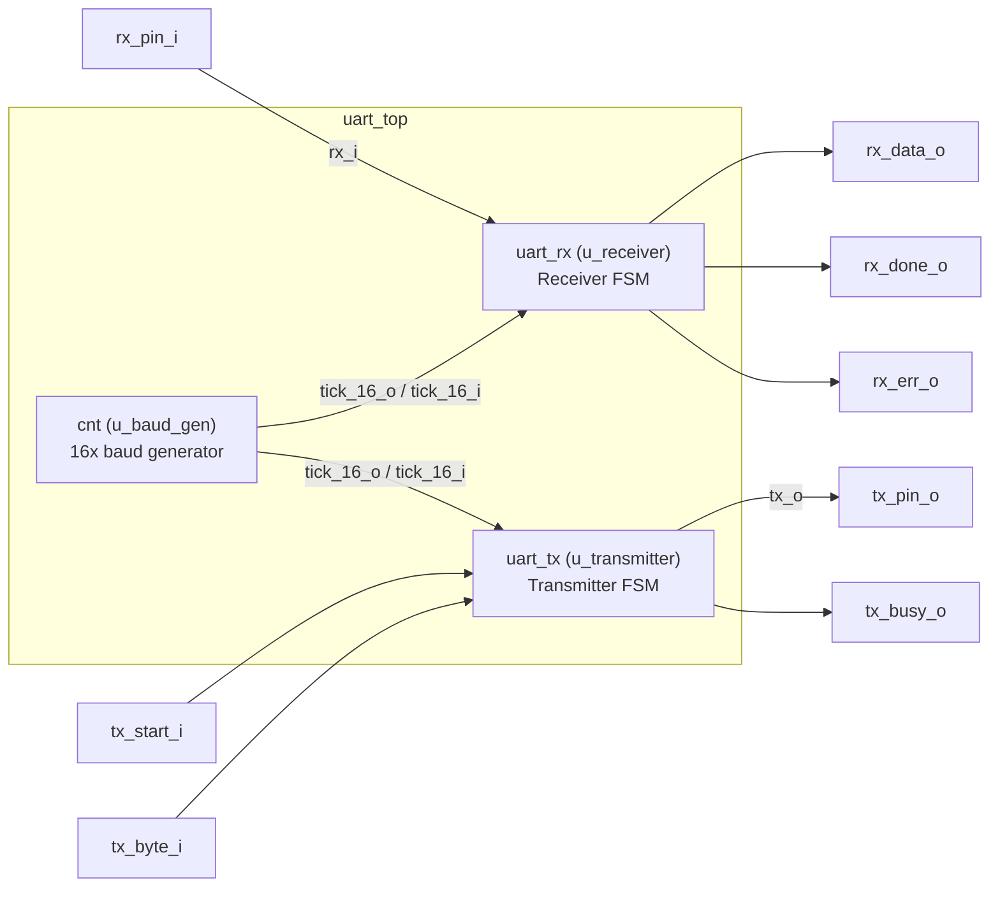
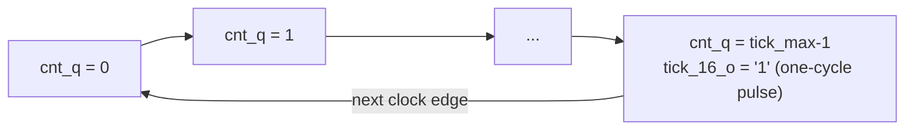
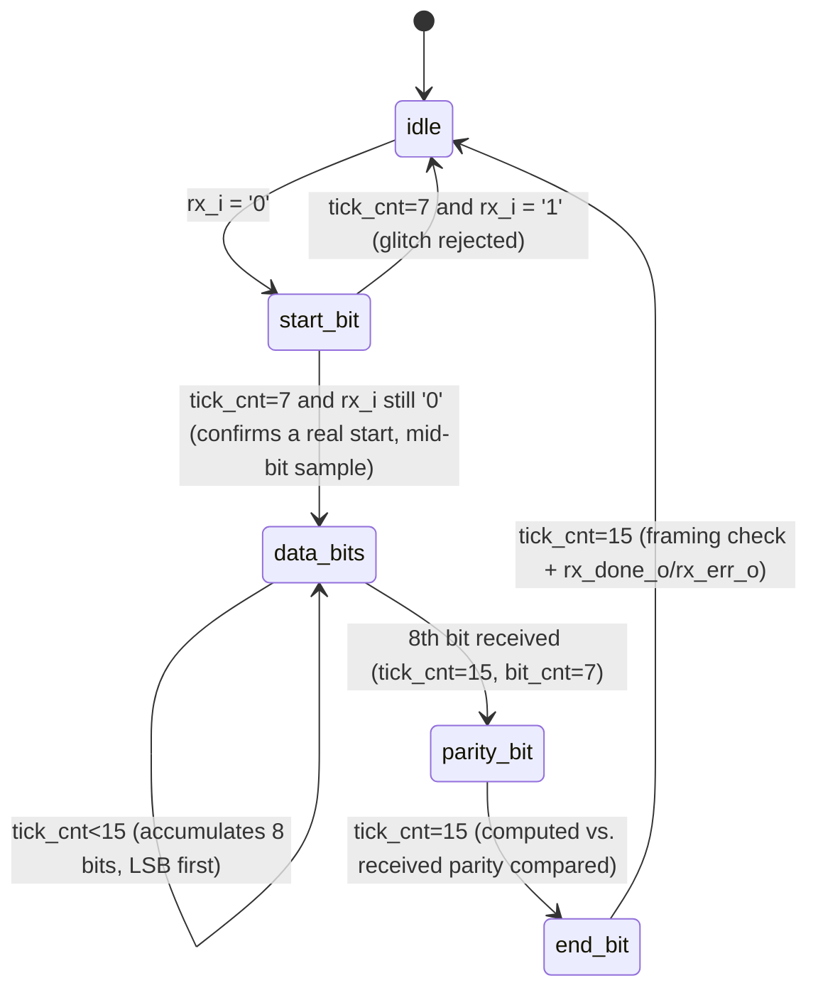
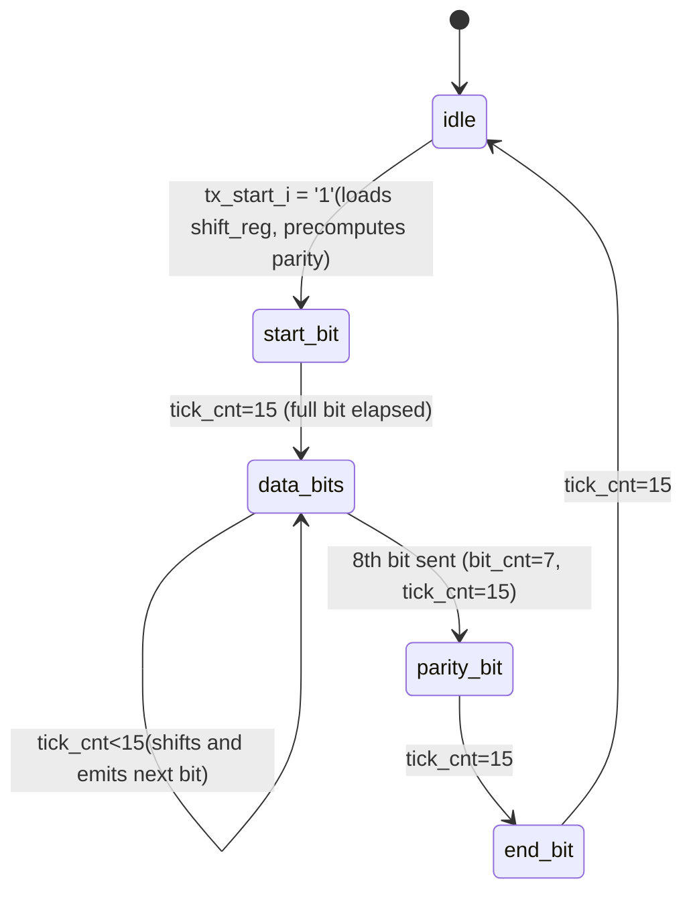

# UART Architecture Report

Analysis of the VHDL design in `rtl/` (5 files) and its verification in `sim/` (4 testbenches).

## 1. Overview

This block implements a general-purpose UART: an independent transmitter (`uart_tx`) and receiver (`uart_rx`), each a self-contained FSM, sharing one baud-rate generator (`cnt`). The goal is a functional, reusable UART pair, delivered as `uart_top.vhd` — a ready-to-plug top level with its host-facing TX/RX ports exposed directly, meant to be dropped into a larger design. A second top, `uart_loopback_top.vhd`, wires the pair into a self-contained echo purely for standalone hardware bring-up (see §7 — it is secondary, testing-only).

Fixed frame format: **1 start bit + 8 data bits (LSB first) + 1 even parity bit + 1 stop bit**, sampled with **16x oversampling** (16 baud-generator ticks per line bit).

## 2. Block diagram



Key points:

- A single baud generator (`cnt`) is shared by RX and TX — both synchronize to the same `tick_16_o`/`tick_16_i` pulse, which simplifies the design but means **RX and TX can't run at different baud rates**.
- `tx_start_i`/`tx_byte_i` and `rx_data_o`/`rx_done_o`/`rx_err_o`/`tx_busy_o` are real top-level ports here — a host drives the former to send a byte and reads the latter to see what was received. Nothing is wired internally between RX and TX; they don't need each other to function.

## 3. `cnt.vhd` — Baud generator

Free-running counter with threshold:

```
tick_max = clk_freq / (16 * baudrate)
```



With the default generics (`clk_freq=100 MHz`, `baudrate=9600`): `tick_max = 651` (integer truncation, ~0.07% baud error — negligible, but the source of any accumulated phase drift on long frames).

`tick_16_o` is a single-cycle pulse (not a divided clock) — the correct way to cross it as a clock-enable within a single clock domain.

## 4. `uart_rx.vhd` — Receiver FSM



| State        | Behavior                                                                                                                                                                                                                                                                                                     |
| ------------ | ------------------------------------------------------------------------------------------------------------------------------------------------------------------------------------------------------------------------------------------------------------------------------------------------------------ |
| `idle`       | Level-detects `rx_i='0'` and enters `start_bit` immediately — no need to wait for a tick, since `start_bit` resynchronizes its own counter from zero.                                                                                                                                                        |
| `start_bit`  | Samples at `tick_cnt=7`, i.e. **mid-bit** (8 of 16 ticks) — the standard noise-rejection technique: if `rx_i` is still `'0'` at mid-bit it's a real start, otherwise it's a glitch and the FSM returns to `idle`.                                                                                            |
| `data_bits`  | Samples every 16 ticks and shifts with `shift_reg <= rx_i & shift_reg(7 downto 1)` — since the first bit received is the LSB, after 8 shifts it lands at `shift_reg(0)` with no reordering needed. Parity is computed in the same cycle as the 8th bit, XOR-ing the incoming bit with the 7 already shifted. |
| `parity_bit` | Compares received vs. computed parity. Does **not** abort on mismatch — only sets `err_flag` and continues into `end_bit`, so the stop bit's 16 ticks are still counted and sync with the next character isn't lost.                                                                                         |
| `end_bit`    | Only here is the frame accepted or rejected: `rx_i='1'` (valid stop bit) **and** no parity error → publish `rx_data_o` + pulse `rx_done_o`; otherwise (bad parity or missing stop bit) → pulse `rx_err_o`.                                                                                                   |

## 5. `uart_tx.vhd` — Transmitter FSM



Mirrors RX's 5-state structure and 16-tick-per-bit cadence, but since TX *generates* the line instead of interpreting it, there is no mid-bit sampling — each state simply holds `tx_o` at the right value for a full 16-tick bit period.

| State        | Behavior                                                                                                                                                                                                                                                                                 |
| ------------ | ---------------------------------------------------------------------------------------------------------------------------------------------------------------------------------------------------------------------------------------------------------------------------------------- |
| `idle`       | Holds `tx_o='1'` (line idle, per the UART standard). On `tx_start_i='1'`: loads `shift_reg <= tx_byte_i` and precomputes `parity_q` as the XOR of all 8 bits in the same cycle — unlike RX, TX already has the whole byte available, so it doesn't need to compute parity incrementally. |
| `start_bit`  | Drives `tx_o <= '0'` for a full 16-tick bit period.                                                                                                                                                                                                                                      |
| `data_bits`  | Emits `tx_o <= shift_reg(0)` (LSB first) and shifts right (`shift_reg <= '0' & shift_reg(7 downto 1)`) every 16 ticks, for 8 bits.                                                                                                                                                       |
| `parity_bit` | Drives `tx_o <= parity_q` (the precomputed parity) for one 16-tick bit period.                                                                                                                                                                                                           |
| `end_bit`    | Drives `tx_o <= '1'` (stop bit) for one 16-tick bit period, then returns to `idle`.                                                                                                                                                                                                      |

`tx_busy_o` is combinational (`'0' when idle else '1'`), avoiding an extra cycle of latency on the busy flag.

## 6. `uart_top.vhd` — Top-level integration (primary)

`uart_top.vhd` exposes `uart_rx`/`uart_tx`'s host-facing ports directly at the top level instead of wiring them to each other: `tx_start_i`/`tx_byte_i` (drive a byte out) and `rx_data_o`/`rx_done_o`/`rx_err_o` (read back whatever was received) are real ports, alongside the physical `rx_pin_i`/`tx_pin_o` pins. This is the block's primary integration point — meant to be dropped into a design where an actual host/processor drives TX and reads RX independently (e.g. reused directly the way `multi/` reuses `uart_rx`/`uart_tx`). `uart_rx` and `uart_tx` don't need each other to function; this top simply makes both of their host interfaces available without adding any wiring between them.

## 7. `uart_loopback_top.vhd` — secondary top, for testing purposes only

Same structural pair (`cnt` + `uart_rx` + `uart_tx`, one shared baud generator), but wired the opposite way to `uart_top.vhd`: `rx_done_o`/`rx_data_o` go straight into `tx_start_i`/`tx_byte_i` internally instead of being exposed, so any byte received on `rx_pin_i` is automatically echoed back out `tx_pin_o`. `rx_err_o` and `tx_busy_o` are computed but left dangling — nothing here needs them.

This is **not** meant for integration into a larger design — it exists purely as a self-contained hardware test harness: plug it onto a board with nothing but a USB-UART connection, and a byte sent in should come back out unchanged, with no host/processor required to drive it (see [`uart_hw_bringup.md`](uart_hw_bringup.md) for the actual test and build steps this was used for). Because both FSMs share the same `t_state` and 16-ticks/bit cadence, the loopback behaves as a serial repeater. There is no back-pressure in this wiring: if a new start bit arrives while TX is still echoing the previous byte, `tx_busy_o` exists internally but is never checked, so the new frame isn't held off — acceptable for a simple bring-up test, not for production use.

## 8. Testbench coverage (`sim/`)

| Testbench                  | DUT(s)                          | Coverage                                                                                                                 |
| --------------------------- | -------------------------------- | ------------------------------------------------------------------------------------------------------------------------- |
| `tb_uart_rx.vhd`            | `cnt` + `uart_rx`                | 4 cases: ideal frame (0x41), line glitch, forced parity error, framing error (missing stop bit)                          |
| `tb_uart_tx.vhd`            | `cnt` + `uart_tx`                 | Transmits 0x41 and checks the full 11-bit frame                                                                          |
| `tb_uart_top.vhd`           | `uart_top` (full system)         | Drives `tx_start_i`/`tx_byte_i` directly (0x41) and separately injects a frame on `rx_pin_i` (0x55) — validates the host-facing wiring in both directions independently |
| `tb_uart_loopback_top.vhd`  | `uart_loopback_top` (full system) | Injects 0x41 on `rx_pin_i`, waits for the echo on `tx_pin_o` — validates end-to-end RX→TX integration for the secondary test top |

All four testbenches are self-checking:

- `tb_uart_rx.vhd` latches `rx_done_o`/`rx_err_o`'s single-cycle pulses (and `rx_data_o`) per frame and asserts the expected outcome for each of its 4 cases (e.g. the parity- and framing-error cases assert `rx_err_o` fired and `rx_done_o` did not).
- `tb_uart_tx.vhd` and `tb_uart_loopback_top.vhd` each reconstruct the transmitted/echoed frame bit-by-bit off `tb_tx`/`tx_pin_o` and assert the byte, parity, and stop bit are all correct — not just that the timing looks right.
- `tb_uart_top.vhd` reuses both techniques above, once per direction, since there's no internal echo to piggyback on.

`tb_uart_rx.vhd`/`tb_uart_tx.vhd`/`tb_uart_loopback_top.vhd` all use the same test byte (`0x41`, 'A'); `tb_uart_top.vhd` deliberately uses a different one (`0x55`) for its RX case so the two directions can't be mistaken for each other in a waveform.

## 9. Findings summary

- ✅ Clean, symmetric RX/TX FSMs with correct LSB-first and even-parity handling.
- ✅ Mid-bit sampling on the RX start bit — a robust, testbench-verified noise-rejection technique.
- ✅ Correct domain separation: a single shared baud generator, fully synchronous state updates.
- ✅ All four testbenches are self-checking: `tb_uart_rx.vhd` asserts the expected `rx_done_o`/`rx_err_o`/`rx_data_o` outcome per case, `tb_uart_tx.vhd`/`tb_uart_top.vhd`/`tb_uart_loopback_top.vhd` assert the transmitted/received/echoed frame byte-for-byte.
- ✅ `tb_uart_tx.vhd`'s `uart_tx` instance previously carried a `generic map` even though `uart_tx` declares no generics — invalid, and (unlike `cnt`'s legitimate one) never actually did anything; removed.
- ✅ `uart_rx`/`uart_tx`/`cnt` needed zero changes to support both top-level flavors — the two tops differ only in how they wire the same unmodified pair.
- ⚠️ `rx_err_o` and `tx_busy_o` are not wired to any top-level output in `uart_loopback_top` — framing/parity errors are invisible outside the design in that configuration (by design: nothing in a self-contained echo test needs them; `uart_top` does expose both).
- ⚠️ No back-pressure between RX and TX in `uart_loopback_top` — a new incoming frame while TX is still echoing the previous one is not handled (affects the secondary loopback top only).
- ⚠️ All four testbenches still only exercise `0x41`/`0x55` — no odd-parity byte, `0x00`, or `0xFF` is exercised.
